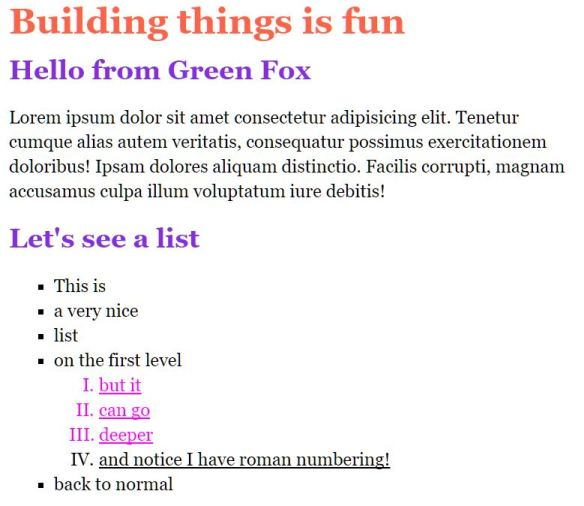
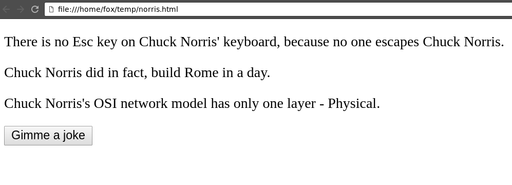

# HTML, CSS, JavaScript

## Házi feladat

| Tananyag | Hossz |
| -------- | ----- |
|[VS Code telepítés (csak 7:30-ig)](https://netacademia.hu/courses/take/bootstrap-tegyuk-4/lessons/6512682-01-mi-az-a-html-kinek-jo-es-mit-lehet-vele-kesziteni-1)| 7:30 |
| [HTML tagek](https://netacademia.hu/courses/take/html5alapozo/lessons/6515654-html-tag-ek-head-body-kulso-fajlok-beszurasa) | 55:00 |
| [HTML attributumok](https://netacademia.hu/courses/take/html5alapozo/lessons/6515646-egyedi-attributumok-ellenorzes-egyszeru-pelda) | 1:04:00  |
| [HTML paragrafusok és listák](https://netacademia.hu/courses/take/html5alapozo/lessons/6515651-fejlecek-paragrafusok-listak-letrehozas-es-formazasa) | 1:22:00 |
| [HTML táblázatok, űrlapok](https://netacademia.hu/courses/take/html5alapozo/lessons/6515656-tablazatok-urlapok-keszitese-mukodese-tulajdonsagai) | 40:00 |
| [Bootstrap gridek és layout](https://netacademia.hu/courses/take/bootstrap/lessons/6458247-2018bt4-2018-03-05-17-00-07-483-cet-0-mp4) | 1:37:00 |
| [Bootstrap elemek](https://netacademia.hu/courses/take/bootstrap/lessons/6458248-2018bt4-2018-03-08-16-59-09-731-cet-0-mp4) | 1:32:04 |
| [Javascript alapok](https://netacademia.hu/courses/take/progjavasc/lessons/6497916-programozas-01-udv-pandoran-1-epizod-1) | 1:16:00 |
| [Javascript DOM](https://netacademia.hu/courses/take/progjavasc/lessons/6497919-programozas-02-udv-pandoran-1-epizod-2) | 1:04:00 |

## HTML és CSS

### Házi feladat ellenőrzés

- Anatomy of an HTML element
- Nesting elements
- Block versus inline elements
- Empty elements
- Core elements
  - `div`
  - `span`
  - `h1` - `h6`
  - `p`
  - `a`
  - `img`
  - `ul`
  - `ol`
  - `li`
- Semantic elements
- Attributes
- Anatomy of an HTML document
- Whitespaces in HTML
- HTML comments
- Forms
  - `form`
  - `input`
  - `textarea`
  - `label`
  - `fieldset`
  - `legend`
- MDN Web Docs
- Anatomy of a CSS ruleset
- Selecting multiple elements
- Different types of selectors
  - Elements
  - Class
- The box model
- Core properties
  - `padding`
  - `border`
  - `margin`
  - `height`
  - `width`
  - `background`
  - `color`
  - `font-size`
- Bootstrap
  - Basic components
    - alert
    - button
    - card
    - form
    - nav
  - Grid
    - container
    - row
    - columns
    - offset
  - Color styles
    - success, warning, danger, info
    - primary, secondary
    - light, dark


### Feladatok

#### Feladat 1


#### Feladat 2


#### Feladat 3



#### Feladat 4


#### Feladat 5


#### Feladat 6


## JavaScript

### Házi feladat ellenőrzés
- Node.js
- Comments
- `console`
- Variables
  - `var`
  - `let`
  - `const`
- Types
  - number
  - string
  - boolean
  - null
  - undefined
- Operators
  - arithmetic
  - logical
  - comparison
  - assignment
  - `typeof`
- Control structures
  - `if`
  - `while`
  - `for`
  - `break`
  - `continue`

```javascript
const b = 20;

if (b < 10) {
  console.log('Yaaay! The value of the \'b\' variable is lower than 10') // This block will NOT run
} else {
  console.log('Yaaay! The value of the \'b\' variable is higher than 10') // This block will run
}

for (let i = 0; i < 100; i++) {
  console.log(i); // Prints the numbers from 0 to 99
}
```

```HTML
<script>
  console.log('Hello World!');
</script>

<script src="something.js"></script>
```
- Window object, window.document object
- DOM
  - getElementById
  - getElementsByClassName
  - querySelectorAll
- Elements
  - Element / Node
  - createElement
  - appendChild
  - innerText, innerHTML
  - attributes
  - className, classList, toggle
  - onclick

```javascript
const king = document.getElementById('b325');
const lamplighter = document.querySelector('.b329');
const asteroids = document.querySelectorAll('div.asteroid');

for (let i = 0; i < asteroids.length; i++) {
  console.log(asteroids[i]);
}
```

- promise
  - `.resolve()`
  - `.reject()`
  - `.then()`
  - `.catch()`
  - `.finally()`
  -  chaining
- Fetch API
  - `fetch()`
- `await`

```javascript
fetch(URL)
  .then(response => response.json())
  .then(myJson => console.log(myJson));
```

### Feladatok

#### Feladat 7

Mutasd be magad változók segítségével! Hozz létre három változót egyet a nevednek, egyet a korodnak és egyet a kedvenc gyümölcsödnek.
Írd ki a konzolra a következőket a változók használatával:
```
Sziasztok, Ádám vagyok 30 éves!
A kedvenc gyümölcsöm a dinnye.
```

#### Feladat 8

Írd ki a konzolra százszor, hogy "Nem fogok csalni a vizsgán."

#### Feladat 9

Írd ki a konzolra a számokat 1-től 100-ig úgy, hogy ha a szám osztható 3-mal, akkor azt írod a szám helyett, hogy "Piff", ha osztható 7-tel, akkor azt, hogy "Puff", ha mindkettővel, akkor pedig azt, hogy "PiffPuff".

#### Feladat 10

Hozz létre egy változót `sorokSzama` néven, amit tölts fel értékkel, pl. `4`. Készíts programot, amely ezt rajzolja ki a konzolra, úgy hogy pont annyi sor legyen, amennyi épp a változó értéke:
```
    *
   ***
  *****
 *******
```

#### Feladat 11

Készíts scriptet az első feladathoz, amelynek segítségével átírod azt a szöveget, hogy "Zerda" arra, hogy "Chama".

#### Feladat 12

Készíts scriptet a második feladathoz, amelynek segítségével mindegyik szöveg fekete színű lesz.

#### Feladat 13

Készíts scriptet a harmadik feladathoz, amelyben létrehozol egy tömb változót, amelybe az alábbi szövegeket tedd: "JavaScript", "HTML", "CSS".
A script segítségével a tömb minden elemét add hozzá HTML-ben található `ul` listához.

#### Feladat 14

Készítsd el az alábbi weblapot, majd készíts hozzá scriptet, amely a gomb megnyomására megnöveli a számot.


#### Feladat 15

Készíts el egy weblapot, amely tartalmaz egy üres `div`-et és egy gombot "Gimme a joke" felirattal. A gombra kattintva indíts `HTTP GET` lekérést erre az url-re: http://api.icndb.com/jokes/random, nézd meg a választ és add hozzá a benne lévő `joke` értékét a `div`-hez.


